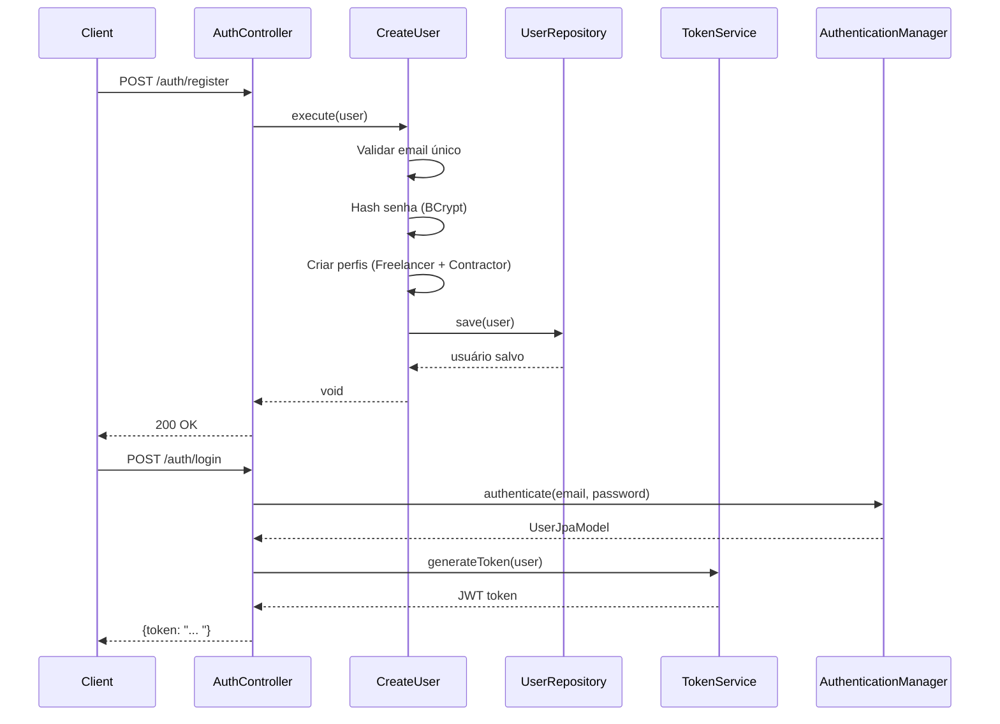
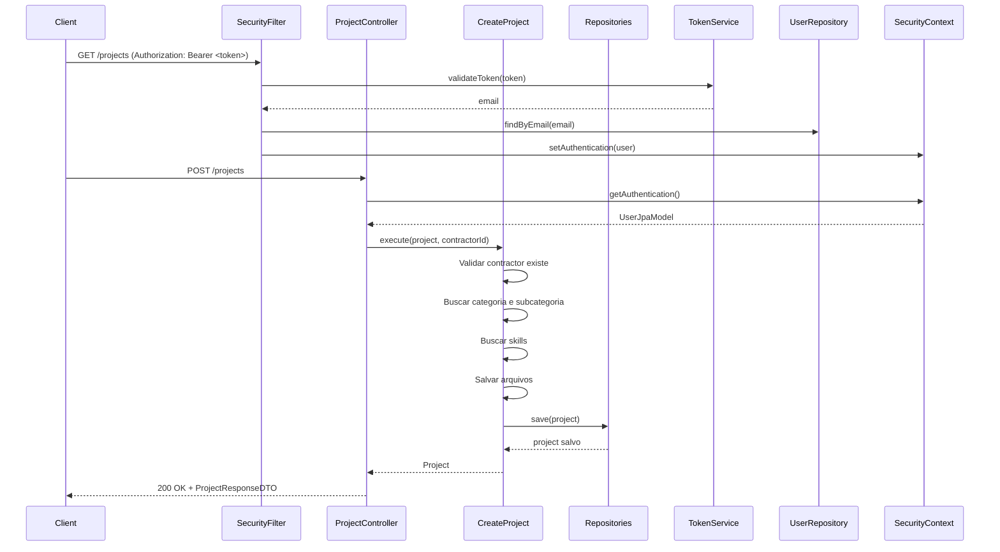
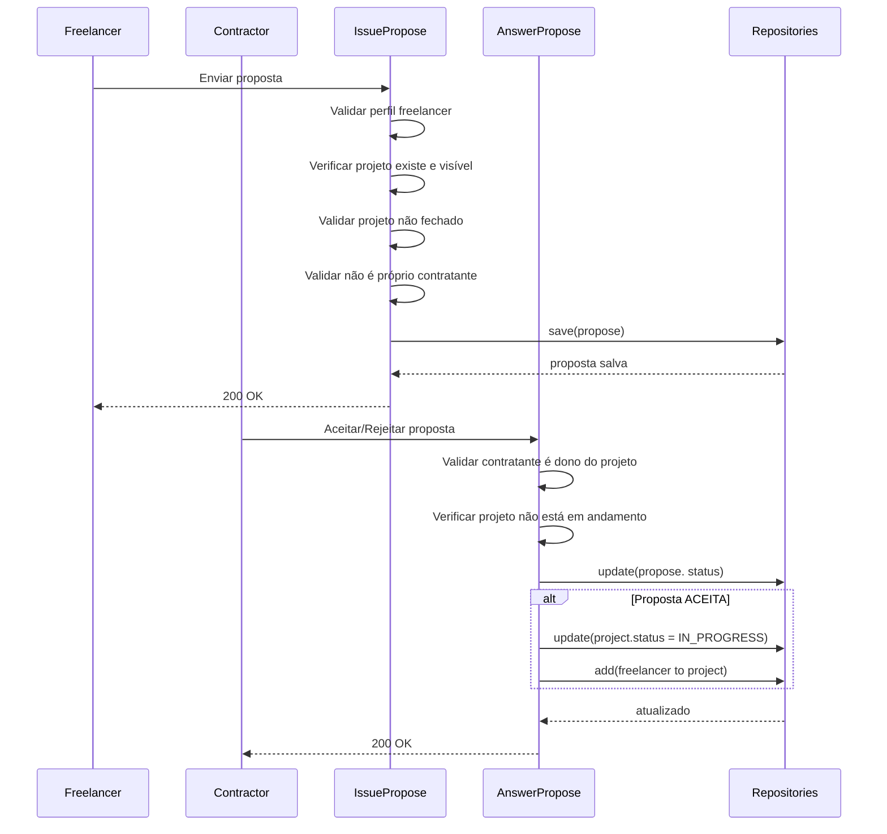

# Documentação de Arquitetura - Marketplace Freelancers

## 1. Visão Geral do Sistema

O **Marketplace Freelancers** é uma plataforma REST API desenvolvida em Java/Spring Boot que conecta freelancers e contratantes, permitindo a criação de projetos, envio de propostas e gerenciamento de relacionamentos profissionais.

### 1.1 Tecnologias Principais

- **Java 21** - Linguagem de programação
- **Spring Boot 4.0.1** - Framework principal
- **PostgreSQL** - Banco de dados relacional
- **Spring Data JPA** - Persistência de dados
- **Spring Security + JWT** - Autenticação e autorização
- **MapStruct** - Mapeamento objeto-objeto
- **Lombok** - Redução de boilerplate
- **SpringDoc OpenAPI** - Documentação da API
- **Gradle** - Gerenciamento de dependências

---

## 2. Arquitetura em Camadas (Clean Architecture)

O projeto segue os princípios da **Clean Architecture** (Arquitetura Limpa), organizando o código em camadas bem definidas com responsabilidades claras e dependências unidirecionais.

```
┌─────────────────────────────────────────────────────┐
│         Presentation Layer (Controllers/DTOs)       │
│                  (API REST)                          │
└───────────────────┬─────────────────────────────────┘
                    │
                    ▼
┌─────────────────────────────────────────────────────┐
│        Application Layer (Use Cases/Mappers)        │
│            (Regras de Negócio)                       │
└───────────────────┬─────────────────────────────────┘
                    │
                    ▼
┌─────────────────────────────────────────────────────┐
│      Domain Layer (Entities/Repositories/Enums)     │
│           (Núcleo do Negócio)                        │
└───────────────────┬─────────────────────────────────┘
                    │
                    ▼
┌─────────────────────────────────────────────────────┐
│   Infrastructure Layer (JPA Models/Repositories)    │
│         (Detalhes de Implementação)                  │
└─────────────────────────────────────────────────────┘
```

### 2.1 Camadas do Sistema

#### **Domain Layer** (`domain/`)
**Responsabilidade**: Núcleo da aplicação contendo as regras de negócio puras.

```
domain/
├── entities/          # Entidades do domínio (POJO)
│   ├── User.java
│   ├── Project.java
│   ├── Propose.java
│   ├── Freelancer.java
│   ├── Contractor.java
│   └── ... 
├── enums/             # Enumerações do domínio
│   ├── ProjectStatus.java
│   ├── ProposeStatus.java
│   └── ExperienceLevel.java
└── repositories/      # Interfaces dos repositórios (contratos)
    ├── UserRepository.java
    ├── ProjectRepository.java
    └── ... 
```

**Características**:
- Entidades com lógica de negócio (ex: `Project. isClosed()`, `Project.isOnGoing()`)
- Sem anotações de framework (puro Java)
- Sem dependências externas
- Repositórios definidos como interfaces (Dependency Inversion Principle)

**Exemplo de Entidade**:
```java
public class Project {
    private Long id;
    private String name;
    private BigDecimal budget;
    private ProjectStatus status;
    private Contractor contractor;
    private List<Propose> proposes;
    
    // Lógica de negócio
    public boolean isClosed() {
        return this.status == ProjectStatus.CLOSED;
    }
    
    public boolean isOnGoing() {
        return this.status == ProjectStatus.IN_PROGRESS 
            || this.status == ProjectStatus.WAITING_PAYMENT;
    }
}
```

---

#### **Application Layer** (`application/`)
**Responsabilidade**:  Orquestra casos de uso e regras de aplicação.

```
application/
├── usecases/          # Casos de uso (Use Cases)
│   ├── CreateProject. java
│   ├── IssuePropose.java
│   ├── AnswerPropose.java
│   ├── CreateUser.java
│   └── ...
├── mappers/           # Conversão entre camadas (MapStruct)
│   ├── ProjectMapper.java
│   ├── UserMapper.java
│   └── ...
├── command/           # Objetos de comando
│   ├── CreateProposeCommand.java
│   └── UpdateProposeStatusCommand.java
└── exceptions/        # Exceções de negócio
    ├── BusinessException.java
    ├── NotFoundException.java
    └── UserAlreadyExistsException.java
```

**Características**:
- Um caso de uso por classe (Single Responsibility Principle)
- Anotados com `@Transactional` para gerenciar transações
- Dependem de interfaces do domínio (não de implementações)
- Contêm validações de regras de negócio

**Exemplo de Caso de Uso**:
```java
@Transactional
public class IssuePropose {
    private final ProposeRepository proposeRepository;
    private final ProjectRepository projectRepository;

    public void execute(CreateProposeCommand command) {
        // Validações de negócio
        if (command.user() == null || 
            command.user().getFreelancerProfile() == null) {
            throw new BusinessException(
                "Usuário não possui perfil de freelancer"
            );
        }

        Project project = projectRepository
            .findByIdIfVisible(command.projectId(), command.user().getId())
            .orElseThrow(() -> new NotFoundException("Projeto não encontrado"));

        if (project.isClosed()) {
            throw new BusinessException("Projeto já está fechado");
        }

        // Lógica de criação da proposta
        // ...
    }
}
```

---

#### **Infrastructure Layer** (`infrastructure/`)
**Responsabilidade**: Implementações técnicas e integrações com frameworks.

```
infrastructure/
├── models/            # Entidades JPA (ORM)
│   ├── UserJpaModel.java
│   ├── ProjectJpaModel.java
│   └── ...
├── repositories/      # Implementação dos repositórios
│   ├── JpaUserRepository.java      # Interface Spring Data JPA
│   ├── UserRepositoryImpl.java     # Implementação do contrato do domínio
│   └── ... 
└── services/          # Serviços de infraestrutura
    └── TokenService.java           # Geração/validação JWT
```

**Características**:
- Modelos JPA anotados com `@Entity`, `@Table`, etc.
- Implementação de repositórios do domínio usando Spring Data JPA
- Mapeamento entre entidades JPA e entidades do domínio via MapStruct

**Exemplo de Implementação de Repositório**:
```java
@Repository
public class ProjectRepositoryImpl implements ProjectRepository {
    private final JpaProjectRepository jpaRepository;
    private final ProjectMapper mapper;

    @Override
    public Project save(Project project) {
        ProjectJpaModel jpaModel = mapper.toJpaEntity(project);
        ProjectJpaModel saved = jpaRepository.save(jpaModel);
        return mapper.toDomain(saved);
    }
    
    @Override
    public List<Project> findAllVisible(Long userId) {
        // Lógica específica de acesso aos dados
        // ...
    }
}
```

---

#### **Presentation Layer** (`presentation/`)
**Responsabilidade**: Interface com o mundo externo (API REST).

```
presentation/
├── controllers/       # Controllers REST
│   ├── ProjectController.java
│   ├── AuthController.java
│   └── ...
└── dtos/              # Data Transfer Objects
    ├── request/
    │   ├── CreateProjectRequestDTO.java
    │   └── LoginRequestDTO.java
    └── response/
        ├── ProjectResponseDTO.java
        └── TokenResponseDTO.java
```

**Características**:
- Anotados com `@RestController` e `@RequestMapping`
- Validação com Bean Validation (`@Valid`, `@NotBlank`, etc.)
- Retornam `ResponseEntity` com DTOs
- Delegam lógica para os casos de uso

**Exemplo de Controller**:
```java
@RestController
@RequestMapping("/projects")
public class ProjectController {
    private final CreateProject createProject;
    private final ProjectMapper projectMapper;

    @PostMapping
    public ResponseEntity<ProjectResponseDTO> create(
            @Valid @RequestBody CreateProjectRequestDTO request) {
        
        // Obter usuário autenticado
        UserJpaModel user = (UserJpaModel) SecurityContextHolder
            .getContext().getAuthentication().getPrincipal();
        
        // Converter DTO para domínio
        Project project = projectMapper.toDomain(request);
        
        // Executar caso de uso
        Project result = createProject.execute(
            project, 
            user.getContractorProfile().getId()
        );
        
        // Retornar resposta
        return ResponseEntity.ok(projectMapper.toDto(result));
    }
}
```

---

## 3. Decisões Arquiteturais

### 3.1 Clean Architecture + DDD (Domain-Driven Design)

**Decisão**: Separar o código em camadas bem definidas seguindo Clean Architecture.

**Motivação**:
- ✅ **Testabilidade**: Lógica de negócio isolada pode ser testada sem framework
- ✅ **Manutenibilidade**: Mudanças em detalhes técnicos não afetam regras de negócio
- ✅ **Flexibilidade**: Facilita troca de frameworks/bibliotecas
- ✅ **Escalabilidade**: Estrutura clara permite crescimento organizado

**Implementação**:
- Entidades do domínio sem anotações JPA
- Repositórios definidos como interfaces no domínio
- Mapeamento explícito entre camadas com MapStruct
- Casos de uso independentes de detalhes de infraestrutura

---

### 3.2 MapStruct para Mapeamento Objeto-Objeto

**Decisão**:  Usar MapStruct para conversão entre DTOs, entidades de domínio e modelos JPA.

**Motivação**:
- ✅ **Performance**: Geração de código em tempo de compilação (sem reflexão)
- ✅ **Type Safety**: Erros detectados em tempo de compilação
- ✅ **Manutenibilidade**: Reduz código boilerplate manual
- ✅ **Flexibilidade**: Suporta mapeamentos complexos e personalizados

**Exemplo**:
```java
@Mapper(componentModel = "spring")
public interface ProjectMapper {
    Project toDomain(ProjectJpaModel jpaEntity);
    ProjectJpaModel toJpaEntity(Project domain);
    ProjectResponseDTO toDto(Project domain);
    Project toDomain(CreateProjectRequestDTO dto);
}
```

---

### 3.3 Autenticação JWT Stateless

**Decisão**:  Implementar autenticação baseada em JWT (JSON Web Token) sem sessões no servidor.

**Motivação**:
- ✅ **Escalabilidade**: Sem necessidade de armazenamento de sessão no servidor
- ✅ **Stateless**: Servidores sem estado facilitam distribuição horizontal
- ✅ **Portabilidade**: Token pode ser usado em diferentes serviços
- ✅ **Performance**: Sem consultas ao banco para validar sessões

**Componentes**:

1. **TokenService**:  Geração e validação de tokens
```java
@Service
public class TokenService {
    public String generateToken(UserJpaModel user) {
        Algorithm algorithm = Algorithm.HMAC256(secret);
        return JWT.create()
            .withIssuer("quixada-api")
            .withSubject(user.getEmail())
            .withExpiresAt(genExpirationDate())
            .withClaim("id", user.getId())
            .withClaim("contractorId", user.getContractorProfile().getId())
            .withClaim("freelancerId", user.getFreelancerProfile().getId())
            .sign(algorithm);
    }
}
```

2. **SecurityFilter**: Intercepta requisições e valida tokens
```java
@Component
public class SecurityFilter extends OncePerRequestFilter {
    @Override
    protected void doFilterInternal(HttpServletRequest request, 
                                    HttpServletResponse response, 
                                    FilterChain filterChain) {
        String token = recoverToken(request);
        if(token != null) {
            String email = tokenService.validateToken(token);
            UserDetails user = userRepo.findByEmail(email).orElse(null);
            if (user != null) {
                var authentication = new UsernamePasswordAuthenticationToken(
                    user, null, user.getAuthorities()
                );
                SecurityContextHolder.getContext()
                    .setAuthentication(authentication);
            }
        }
        filterChain.doFilter(request, response);
    }
}
```

3. **SecurityConfig**: Configuração de regras de segurança
```java
@Configuration
@EnableWebSecurity
public class SecurityConfig {
    @Bean
    public SecurityFilterChain securityFilterChain(HttpSecurity http) {
        return http
            .sessionManagement(s -> 
                s.sessionCreationPolicy(SessionCreationPolicy.STATELESS))
            .authorizeHttpRequests(auth -> auth
                .requestMatchers("/auth/**").permitAll()
                .anyRequest().authenticated()
            )
            .addFilterBefore(securityFilter, 
                UsernamePasswordAuthenticationFilter.class)
            .csrf(AbstractHttpConfigurer::disable)
            .build();
    }
}
```

**Fluxo de Autenticação**:
1. Usuário faz login (`POST /auth/login`)
2. Sistema valida credenciais com `AuthenticationManager`
3. Token JWT é gerado com informações do usuário
4. Cliente envia token no header `Authorization: Bearer <token>`
5. `SecurityFilter` valida token e autentica usuário
6. Usuário autenticado acessa recursos protegidos

---

### 3.4 Injeção de Dependências via Beans

**Decisão**: Configurar casos de uso como beans Spring via classe `DomainConfig`.

**Motivação**:
- ✅ **Controle**: Gerenciamento explícito de dependências
- ✅ **Testabilidade**: Facilita criação de mocks em testes
- ✅ **Desacoplamento**: Camada de domínio não depende de anotações Spring
- ✅ **Visibilidade**: Todas as dependências visíveis em um único lugar

**Implementação**:
```java
@Configuration
public class DomainConfig {
    @Bean
    public CreateProject createProject(
            FileRepository fileRepository,
            SubcategoryRepository subRepo,
            CategoryRepository categoryRepository,
            ProjectRepository projectRepository,
            SkillRepository skillRepository,
            ContractorRepository contractorRepository) {
        return new CreateProject(
            fileRepository, subRepo, categoryRepository,
            projectRepository, skillRepository, contractorRepository
        );
    }

    @Bean
    public IssuePropose issuePropose(
            ProposeRepository proposeRepository,
            ProjectRepository projectRepository) {
        return new IssuePropose(proposeRepository, projectRepository);
    }
    
    @Bean
    public PasswordEncoder passwordEncoder() {
        return new BCryptPasswordEncoder();
    }
}
```

---

### 3.5 Perfis Duplos (Freelancer + Contractor)

**Decisão**: Todo usuário possui ambos os perfis (freelancer e contratante) criados automaticamente.

**Motivação**:
- ✅ **Flexibilidade**: Usuário pode atuar em ambos os papéis
- ✅ **Simplicidade**: Evita complexidade de ativação de perfis
- ✅ **UX**: Melhor experiência do usuário (sem barreiras)

**Implementação**:
```java
@Transactional
public class CreateUser {
    public void execute(User userDomain) {
        // Validações... 
        
        var freelancerProfile = new Freelancer();
        var contractorProfile = new Contractor();
        
        freelancerProfile.setUser(userDomain);
        contractorProfile.setUser(userDomain);
        
        userDomain.setFreelancerProfile(freelancerProfile);
        userDomain. setContractorProfile(contractorProfile);
        
        userRepository.save(userDomain);
    }
}
```

**Token JWT inclui ambos os IDs**:
```json
{
  "id": 1,
  "email": "user@example.com",
  "contractorId": 10,
  "freelancerId":  20,
  "exp": 1234567890
}
```

---

### 3.6 Visibilidade de Projetos (Públicos/Privados)

**Decisão**: Projetos podem ser públicos ou privados com controle de visibilidade no repositório.

**Motivação**:
- ✅ **Segurança**: Projetos privados só visíveis para envolvidos
- ✅ **Flexibilidade**: Contratante escolhe nível de exposição
- ✅ **Privacidade**: Proteção de informações sensíveis

**Implementação**:
```java
public interface ProjectRepository {
    List<Project> findAllVisible(Long userId);
    Optional<Project> findByIdIfVisible(Long projectId, Long userId);
    boolean userCanViewProject(Long userId, Long projectId);
}
```

**Regras de Visibilidade**:
- Projetos **públicos**:  Visíveis para todos os usuários autenticados
- Projetos **privados**: Visíveis apenas para:
    - Contratante (dono do projeto)
    - Freelancers que enviaram propostas
    - Freelancers atribuídos ao projeto

---

### 3.7 Gestão de Transações

**Decisão**:  Usar `@Transactional` nos casos de uso (não nos repositórios).

**Motivação**:
- ✅ **Consistência**: Garante ACID em operações complexas
- ✅ **Atomicidade**: Múltiplas operações executadas como uma unidade
- ✅ **Controle**: Transação no nível da regra de negócio

**Exemplo**:
```java
@Transactional
public class AnswerPropose {
    public void execute(UpdateProposeStatusCommand command) {
        // 1. Buscar proposta
        Propose propose = proposeRepository.findById(command.proposeId())
            .orElseThrow(() -> new NotFoundException("Proposta não encontrada"));

        // 2. Validar permissões
        if (!Objects.equals(project.getContractor().getUser().getId(), 
                            command. contractorUserId())) {
            throw new AccessDeniedException("Sem permissão");
        }

        // 3. Atualizar status
        propose.setStatus(command.newStatus());
        proposeRepository. save(propose);

        // 4. Atualizar projeto (se aceito)
        if (command.newStatus() == ProposeStatus.ACCEPTED) {
            project.setStatus(ProjectStatus.IN_PROGRESS);
            project.getFreelancers().add(propose.getFreelancer());
            projectRepository. updateProject(project);
        }
        
        // Tudo commitado junto ou revertido em caso de erro
    }
}
```

---

### 3.8 Exception Handling Centralizado

**Decisão**:  Tratamento de exceções em um handler global (não implementado no código analisado, mas recomendado).

**Recomendação**:
```java
@RestControllerAdvice
public class GlobalExceptionHandler {
    @ExceptionHandler(BusinessException.class)
    public ResponseEntity<ErrorResponse> handleBusinessException(
            BusinessException ex) {
        return ResponseEntity.badRequest()
            .body(new ErrorResponse(ex.getMessage()));
    }
    
    @ExceptionHandler(NotFoundException.class)
    public ResponseEntity<ErrorResponse> handleNotFoundException(
            NotFoundException ex) {
        return ResponseEntity.status(HttpStatus.NOT_FOUND)
            .body(new ErrorResponse(ex.getMessage()));
    }
    
    @ExceptionHandler(AccessDeniedException.class)
    public ResponseEntity<ErrorResponse> handleAccessDenied(
            AccessDeniedException ex) {
        return ResponseEntity.status(HttpStatus.FORBIDDEN)
            .body(new ErrorResponse(ex.getMessage()));
    }
}
```

---

## 4. Principais Casos de Uso

### 4.1 Gestão de Usuários
- **CreateUser**: Registra novo usuário com perfis automáticos
- Autenticação via JWT

### 4.2 Gestão de Projetos
- **CreateProject**: Contratante cria projeto com categorias, skills, arquivos
- **GetAllProjects**: Lista projetos visíveis para o usuário
- **GetProjectById**: Detalha projeto (se visível)

### 4.3 Gestão de Propostas
- **IssuePropose**: Freelancer envia proposta para projeto
- **AnswerPropose**: Contratante aceita/rejeita proposta
    - Se aceito: projeto vai para "EM_PROGRESSO" e freelancer é vinculado

### 4.4 Visibilidade Inteligente
- Filtragem automática de projetos baseada em visibilidade
- Controle de acesso granular

---

## 5. Padrões e Boas Práticas

### 5.1 Padrões Aplicados

| Padrão | Aplicação |
|--------|-----------|
| **Repository Pattern** | Abstração de acesso a dados |
| **DTO Pattern** | Separação entre API e domínio |
| **Mapper Pattern** | Conversão entre camadas |
| **Use Case Pattern** | Encapsulamento de regras de negócio |
| **Dependency Inversion** | Dependência de abstrações (interfaces) |
| **Single Responsibility** | Uma responsabilidade por classe |
| **Factory Pattern** | Configuração de beans no DomainConfig |

### 5.2 Boas Práticas

✅ **Validação em múltiplas camadas**:
- DTOs:  Validação de sintaxe (`@NotBlank`, `@Email`)
- Use Cases: Validação de regras de negócio
- Domínio: Validação de invariantes

✅ **Imutabilidade quando possível**:
- DTOs como `record` (Java 14+)
- Comandos imutáveis

✅ **Nomes expressivos**:
- Casos de uso com verbos (`CreateProject`, `IssuePropose`)
- Repositórios com substantivos (`ProjectRepository`)

✅ **Testes em múltiplos níveis**:
- Testes unitários de casos de uso
- Testes de integração com banco de dados
- Exemplo: `AnswerProposeIntegrationTest`

---

## 6. Estrutura de Diretórios

```
marketplace-freelancers/
├── api/
│   ├── src/
│   │   ├── main/
│   │   │   ├── java/com/ufc/quixada/api/
│   │   │   │   ├── ApiApplication.java
│   │   │   │   ├── application/              # 📦 Camada de Aplicação
│   │   │   │   │   ├── command/
│   │   │   │   │   ├── exceptions/
│   │   │   │   │   ├── mappers/
│   │   │   │   │   └── usecases/
│   │   │   │   ├── config/                    # ⚙️ Configurações Spring
│   │   │   │   │   ├── DomainConfig.java
│   │   │   │   │   ├── SecurityConfig.java
│   │   │   │   │   └── SecurityFilter.java
│   │   │   │   ├── domain/                    # 🏛️ Camada de Domínio
│   │   │   │   │   ├── entities/
│   │   │   │   │   ├── enums/
│   │   │   │   │   └── repositories/
│   │   │   │   ├── infrastructure/            # 🔧 Camada de Infraestrutura
│   │   │   │   │   ├── models/
│   │   │   │   │   ├── repositories/
│   │   │   │   │   └── services/
│   │   │   │   └── presentation/              # 🌐 Camada de Apresentação
│   │   │   │       ├── controllers/
│   │   │   │       └── dtos/
│   │   │   └── resources/
│   │   │       └── application. properties
│   │   └── test/                              # 🧪 Testes
│   │       └── java/com/ufc/quixada/api/
│   │           ├── integration/
│   │           └── application/usecases/
│   ├── build.gradle
│   ├── docker-compose-dev.yml
│   └── mocks. md
└── README.md
```

---

## 7. Fluxos Principais

### 7.1 Fluxo de Registro e Autenticação



### 7.2 Fluxo de Criação de Projeto



### 7.3 Fluxo de Proposta (Issue + Answer)



---

## 8. Considerações de Segurança

### 8.1 Autenticação e Autorização
- ✅ Senhas hash com BCrypt (salt automático)
- ✅ Tokens JWT com expiração
- ✅ Stateless authentication
- ✅ CORS configurado
- ✅ CSRF desabilitado (adequado para APIs stateless)

### 8.2 Controle de Acesso
- ✅ Verificação de propriedade de recursos (ex: contractor pode responder propostas)
- ✅ Visibilidade de projetos controlada
- ✅ Exceções `AccessDeniedException` lançadas quando apropriado

### 8.3 Validação de Entrada
- ✅ Bean Validation em DTOs
- ✅ Validações de regras de negócio em casos de uso
- ✅ Exceptions customizadas (`BusinessException`, `NotFoundException`)

---

## 9. Melhorias Sugeridas

### 9.1 Curto Prazo

1. **Exception Handler Global**
    - Implementar `@RestControllerAdvice` para tratamento centralizado

2. **Logging Estruturado**
    - Adicionar SLF4J/Logback para logs consistentes
    - Implementar correlation IDs para rastreamento

3. **Paginação**
    - Adicionar suporte a paginação em listagens (Spring Data Pageable)

4. **Documentação OpenAPI**
    - Enriquecer anotações Swagger para melhor documentação

### 9.2 Médio Prazo

1. **Testes Automatizados**
    - Aumentar cobertura de testes unitários
    - Adicionar testes de contrato (Spring Cloud Contract)
    - Testes de segurança (OWASP)

2. **Observabilidade**
    - Integrar Spring Actuator com Prometheus/Grafana
    - Implementar distributed tracing (OpenTelemetry)

3. **Cache**
    - Implementar cache distribuído (Redis) para consultas frequentes

4. **Rate Limiting**
    - Adicionar throttling para proteção contra abuso

### 9.3 Longo Prazo

1. **Arquitetura de Microserviços**
    - Separar em serviços:  User Service, Project Service, Propose Service
    - Implementar Event-Driven Architecture com message broker (RabbitMQ/Kafka)

2. **CQRS**
    - Separar comandos e consultas para melhor performance

3. **Event Sourcing**
    - Armazenar histórico completo de mudanças em projetos/propostas

---

## 10. Referências

### 10.1 Padrões Arquiteturais
- [Clean Architecture - Robert C. Martin](https://blog.cleancoder.com/uncle-bob/2012/08/13/the-clean-architecture. html)
- [Domain-Driven Design - Eric Evans](https://martinfowler.com/bliki/DomainDrivenDesign.html)
- [Hexagonal Architecture](https://alistair.cockburn.us/hexagonal-architecture/)

### 10.2 Tecnologias
- [Spring Boot Documentation](https://spring.io/projects/spring-boot)
- [Spring Security JWT](https://spring.io/guides/tutorials/spring-boot-oauth2/)
- [MapStruct Documentation](https://mapstruct.org/)
- [PostgreSQL Documentation](https://www.postgresql.org/docs/)

### 10.3 Boas Práticas
- [SOLID Principles](https://www.digitalocean.com/community/conceptual_articles/s-o-l-i-d-the-first-five-principles-of-object-oriented-design)
- [REST API Design Guidelines](https://restfulapi.net/)
- [Java Coding Standards](https://google.github.io/styleguide/javaguide.html)

---

## 11. Glossário

| Termo | Definição |
|-------|-----------|
| **DTO** | Data Transfer Object - Objeto usado para transferir dados entre camadas |
| **JPA** | Java Persistence API - Especificação para ORM em Java |
| **JWT** | JSON Web Token - Padrão para autenticação stateless |
| **ORM** | Object-Relational Mapping - Mapeamento objeto-relacional |
| **Use Case** | Caso de uso - Ação específica que o sistema pode realizar |
| **MapStruct** | Biblioteca para geração automática de código de mapeamento |
| **BCrypt** | Algoritmo de hash de senhas com salt integrado |
| **Stateless** | Arquitetura onde o servidor não mantém estado entre requisições |
| **ACID** | Atomicidade, Consistência, Isolamento, Durabilidade (propriedades de transações) |

---

**Última atualização**:  2026-01-13  
**Versão**: 1.0  
**Autores**: Equipe Marketplace Freelancers